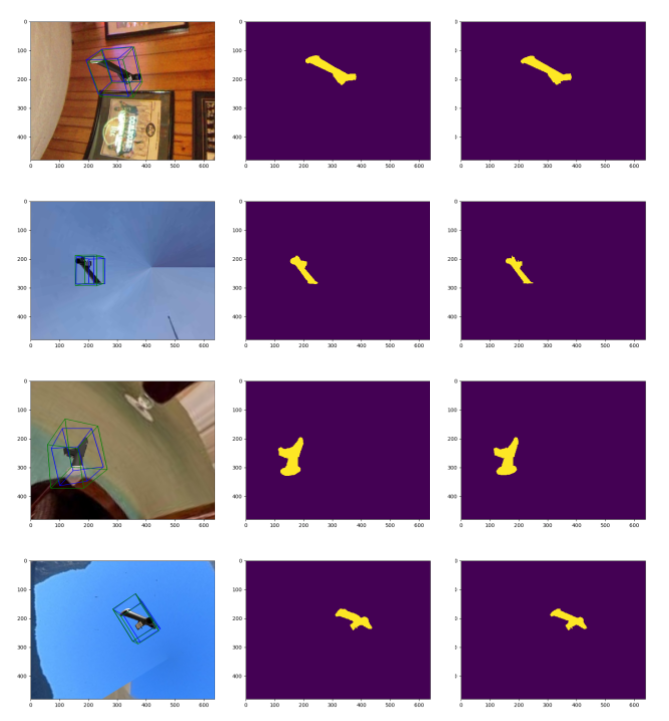

# Master thesis 2019 - Volvo / Chalmers / NTNU

Code used for the master project can be found here as well as linked libraries. 

# Results - Instance Segmentation
Results under are shown if the confidence is greater than 0.40. This threshold should be set closer to 0.85 for more robust inference, but for illustratory purposes it has been lowered.

Previous results            |  Obtained results
:-------------------------:|:-------------------------:
  |  

# Results - Pose estimation
Evaluation on different synthetic data yielded some decent results. Pose predictions are illustrated with a blue 3D bounding box, whereas ground truth pose is illustrated as the green counterpart.

Evaluation on real images confirms that it is beneficial to either add real images in the training data, utilize depth information or simulate the real world even better.
  
 Obtained results
:-------------------------:
  

# Installation
1) The external open source projects used are Mask-RCNN (https://github.com/matterport/Mask_RCNN), DOPE (https://github.com/NVlabs/Deep_Object_Pose) and PVNet (https://github.com/zju3dv/pvnet).

2) If you attempt to recreate this project the first thing you need to keep track of is your CUDA version and it's compatability with the different runtime frameworks (PyTorch and TensorFlow). At the time of writing PyTorch is also compatible with the hardware architecture of the new touring RTX nvidia graphics series.

3) Follow the respective installation instructions for setting up each environment with it's dependencies.

4) One would be encouraged to use docker for the easiest installation with respect to DOPE. Here one needs to rememeber to append export ROS_MASTER_URI=http://localhost:11311 to the ~/.bashrc of the remote (outside the docker environment) and append 
source /opt/ros/kinetic/setup.bash
export ROS_MASTER_URI=http://172.x.x.x
3) Additional info for pvnet:
In order to not run into too many package conflicts it is recommended to try and install as much as possible with anaconda and then install the remainding with pip3.

