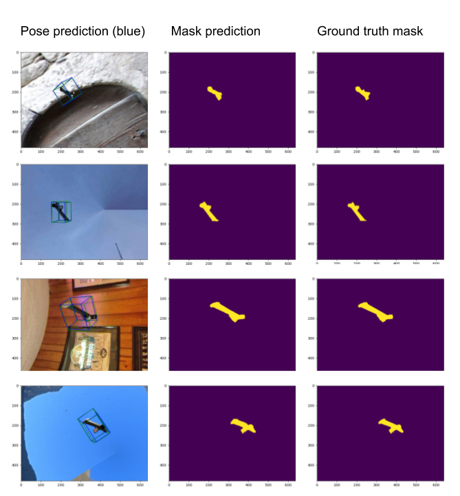

# Master thesis 2019 - Chalmers / NTNU / Volvo
[PDF](https://odr.chalmers.se/bitstream/20.500.12380/300527/1/Lecerof_Opheim_2019.pdf) - Master thesis
Code used for the master project can be found here as well as linked libraries.

## Results - Instance Segmentation
Results under are shown if the confidence is greater than ```0.40```. This threshold should be set closer to ```0.85``` for more robust inference, but for illustratory purposes it has been lowered.

Previous results            |  Obtained results
:-------------------------:|:-------------------------:
  |  

## Results - Pose estimation
Evaluation on different synthetic data yielded some decent results. Pose predictions are illustrated with a blue 3D bounding box, whereas ground truth pose is illustrated as the green counterpart.
<p align="center">

</p>

Evaluation on real images confirms that it is beneficial to either add real images in the training data, utilize depth information or simulate the real world even better.

Obtained results
:-------------------------:
  

## Installation
1) The external open source projects used are:
* [Mask-RCNN](https://github.com/matterport/Mask_RCNN) - Instance segmentation,
* [PVNet](https://github.com/zju3dv/pvnet) - Pose estimation.
* [PVNet-rendering](https://github.com/zju3dv/pvnet-rendering) - Dataset generation

2) If you attempt to recreate this project the first thing you need to keep track of is your CUDA version and it's compatability with the different runtime frameworks (PyTorch and TensorFlow). At the time of writing PyTorch is also compatible with the hardware architecture of the new touring RTX nvidia graphics series.

3) Follow the respective installation instructions for setting up each environment with it's dependencies, installing as much as possible with conda before resolving the remaining with pip.

4) Weights and part specific files are not supplied here due to size restriction on Github as well as IPR.


## Authors

* **Torbjørn Opheim** - *Norwegian University of Science and Technology*
* **Jonas Lecerof** - *Chalmers University of Technology*

## License

This project is licensed under the MIT License - see the [LICENSE](LICENSE) file for details


